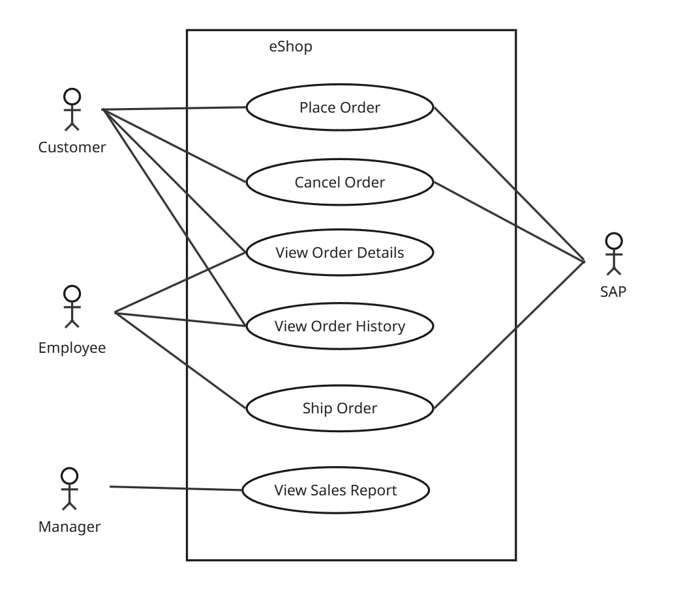

# System Behavior (Use Cases)

## Use Case Diagram

Primary Actors:
- Customers
- Employees
- Managers

Use Cases:
- Place Order
- Cancel Order
- View Order Details
- View Order History
- Ship Order
- View Sales Report

Secondary Actors:
- SAP

## Use Case Narrative: Place Order

### Use Case Name
Place Order

### Primary Actor
Customer

### Goal
The customer successfully places an order for a product.

### Preconditions
- The customer is registered and logged into the system.
- The products to be ordered exist in SAP.

### Main Success Scenario
1. The customer enters a product SKU.
2. The customer enters the desired quantity.
3. The customer submits the order.
4. The system validates the desired quantity.
5. The system validates that the product exists SAP.
6. The system creates the order.
7. The system provides an order confirmation to the customer.

### Extensions (Alternative Flows)
- 4a. Non-positive quantity:
    - The system notifies the customer and suggests entering a valid quantity.
- 5a. SAP is unavailable:
    - The system notifies the customer that product information cannot be retrieved at this time.
- 5b. Product not available:
    - The system notifies the customer and suggests removing or replacing unavailable items.

### Postconditions
- The order is created and stored in the system.
- The customer receives an order confirmation.

## Use Case Narrative: Cancel Order

In a Real Life Project, we would write Use Case Narratives for the other Use Cases too. In this Sandbox Project, I've omitted writing the other Use Cases.