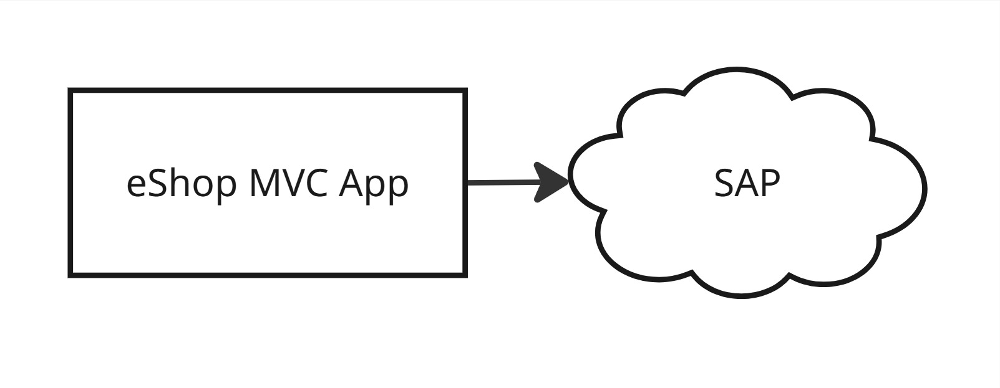

# System Behavior (Architecture)

## Architecture Style

- Monolith (MVC App)

Note: I've chosen a Monolith for purposes of this course, because Acceptance Tests are insensitive to architecture choice. So the choice of architecture is irrelevant, for the purposes of this course. However, in your case, for better translatability to your Real Life Project, I recommend choosing the Architecture Style reflects your Real Life Project. But if you're limited with time, then go with a Monolith, and you can change your Architecture Style later, it shouldn't affect your Acceptance Tests.

## Architecture Diagram

This is the Monolith Architecture:

Alternatively, we could have designed Frontend & Monolithic Backend:

Alternatively, we could have designed Frontend & Microservice Backend:

## Tech Stack

Programming Languages:
- Java
- C#
- TypeScript

Database:
- Postgres

Note: For purposes of the ATDD Accelerator Program, I'll be implementing the same functionality in three different languages, so that you can follow your preferred language.

## Repository Strategy

Mono-repo Repository Structure

Note: I've chosen the Mono-repo structure because, for purposes of this program, we don't really care about the Repository Strategy. However, in your case, for better transferability to your Real Life Project, I recommend chosing the Repository Strategy that you're doing at work.

## Component Repositories

Note: Since I've chosen Mono-repo for the ATDD Accelerator demo, it means there won't be any Component Repositories. In your case, if you've chosen multi-repo approach, then you would list (with links) your Component Repositories (e.g. Frontend Repository & Backend Repository; Frontend Repository, Ordering Microservice Repository, Product Microservice Repository).